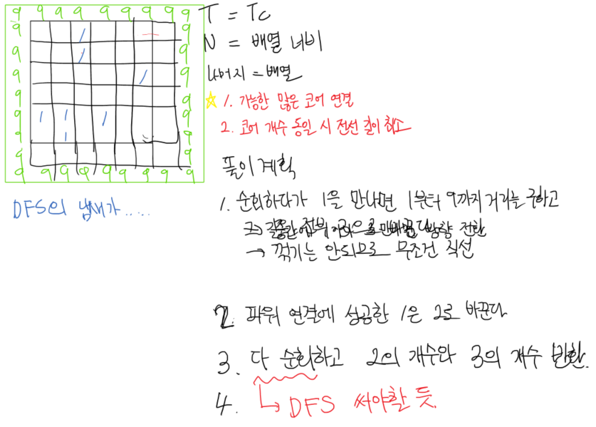

## 🐌 알고리즘 문제 풀이

### 1767. 프로세서 연결하기


#### 📒문제

> 최신 모바일 프로세서 멕시노스는 가로 N개 x 세로 N개의 cell로 구성되어 있다. (7<=N<=12)
>
> 1개의 cell에는 1개의 Core 혹은 1개의 전선이 올 수 있다. (1개<=Core<=12개)
>
> 멕시노스의 가장 자리에는 전원이 흐르고 있다.
>
> Core와 전원을 연결하는 전선은 직선으로만 설치가 가능하며, 전선은 절대 교차해서는 안된다.
>
> 최대한 많은 Core에 전원을 연결하였을 경우, 전선 길이의 합을 구하고자 한다.
> (단, 여러 방법이 있을 경우, 전선 길이의 합이 최소가 되는 값을 구하라.)
>
> [<문제 출처>][https://swexpertacademy.com/main/code/problem/problemDetail.do?contestProbId=AV4suNtaXFEDFAUf]

---

> 예시

​	입력										출력

​	7  											\#1 12
​	0 0 1 0 0 0 0
​	0 0 1 0 0 0 0
​	0 0 0 0 0 1 0
​	0 0 0 0 0 0 0
​	1 1 0 1 0 0 0
​	0 1 0 0 0 0 0
​	0 0 0 0 0 0 0

----


#### 🚀point

1. 연결된 코어의 개수가 최댓값이어야 한다.

1. 그 중 전선의 길이는 최소가 되어야한다.

   

#### 🔎풀이

1. 

   


#### 💻코드

```python
T = int(input())

def danjo_check(number):
    lst = list(map(int,list(str(number))))

    for i in range(1,len(lst)) :
        if lst[i-1] > lst[i] :
            return -1
    else :
        return 1

for tc in range(T) :
    N = int(input())
    numbers = list(map(int,input().split()))

    danjo = -1
    for j in range(1,N) :
        tmp = numbers[j-1]*numbers[j]
        res = danjo_check(tmp)
        if res == 1 and danjo < tmp :
            danjo = tmp

    print(f"#{tc+1} {danjo}")

```


#### ❌ 발생 오류 및 해결

- 계속해서 TC 50개 중 9개를 제외한 전부가 오답처리

  - Ai 와 Aj. 즉, i와 j가 연속이 아니라면???? 문제의 조건에서는 i<j 일뿐 j=i+1 이라고 한 적이 없음.

  - 따라서, Ai와 AJ가 연속으로 이루어진 숫자가 아닐 수도 있지 않을까??

    - 빙고!

      

#### 💻재작성 코드

```python
T = int(input())

def danjo_check(number):
    lst = list(map(int,list(str(number))))

    for i in range(1,len(lst)) :
        if lst[i-1] > lst[i] :
            return -1
    else :
        return 1

for tc in range(T) :
    N = int(input())
    numbers = list(map(int,input().split()))

    danjo = -1
    for i in range(N-1) : #i와 j는 연속이 아니기 때문에 i와 i를 제외한 나머지를 전부 곱한다
        for j in range(i+1,N) :
            tmp = numbers[i]*numbers[j]
            res = danjo_check(tmp)
            if res == 1 and danjo < tmp :
                danjo = tmp

    print(f"#{tc+1} {danjo}")
```

