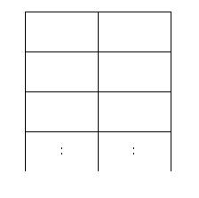

# 1309번 동물원


## 문제

어떤 동물원에 가로로 두칸 세로로 N칸인 아래와 같은 우리가 있다.



이 동물원에는 사자들이 살고 있는데 사자들을 우리에 가둘 때, 가로로도 세로로도 붙어 있게 배치할 수는 없다. 이 동물원 조련사는 사자들의 배치 문제 때문에 골머리를 앓고 있다.

동물원 조련사의 머리가 아프지 않도록 우리가 2*N 배열에 사자를 배치하는 경우의 수가 몇 가지인지를 알아내는 프로그램을 작성해 주도록 하자. 사자를 한 마리도 배치하지 않는 경우도 하나의 경우의 수로 친다고 가정한다.


## 입력

첫째 줄에 우리의 크기 N(1≤N≤100,000)이 주어진다.


## 출력

첫째 줄에 사자를 배치하는 경우의 수를 9901로 나눈 나머지를 출력하여라.


## Point


1. 사자 우리의 각 행 마다 사자를 배치할 수 있는 경우의 수는

   -  해당 행에 사자 배치 x
   - 왼쪽에 배치
   - 오른쪽에 배치

   위와 같이 세 가지가 존재한다. 따라서 경우의 수의 개수인 각 행마다 열이 3개인 dp 배열을 할당한다.

1. 해당 행에 사자를 배치하지 않는 경우는 i-1 행의 모든 경우에 해당됨으로 dp[i-1] 값을 모두 더해 가져온다.

1. 왼쪽이나 오른쪽에 사자를 배치할 경우는 i-1 행에서 사자가 존재하지 않거나 대각선 방향에 사자가 있을 경우만 포함함으로 이를 점화식으로 표현한다.


## CODE


```python
import sys

dp = [[0,0,0] for t in range(int(sys.stdin.readline()))]

dp[0] = [1,1,1]

for i in range(1,len(dp)):
    dp[i][0] = sum(dp[i-1]) % 9901
    dp[i][1] = (dp[i-1][0] + dp[i-1][2]) % 9901
    dp[i][2] = (dp[i-1][0] + dp[i-1][1]) % 9901

print(sum(dp[-1]) % 9901)
```

