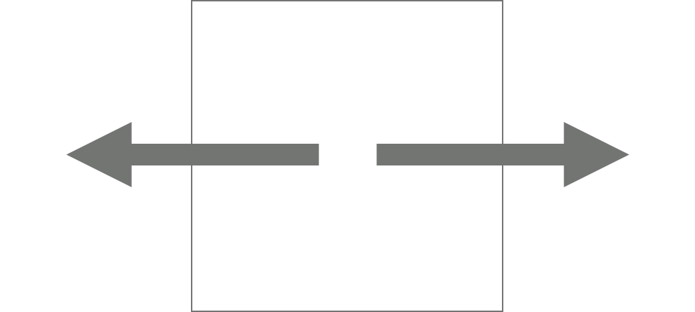

# 15683번 감시


## 문제

스타트링크의 사무실은 1×1크기의 정사각형으로 나누어져 있는 N×M 크기의 직사각형으로 나타낼 수 있다. 사무실에는 총 K개의 CCTV가 설치되어져 있는데, CCTV는 5가지 종류가 있다. 각 CCTV가 감시할 수 있는 방법은 다음과 같다.

|  |  |  |  |  |
| -------------------------- | -------------------------- | -------------------------- | -------------------------- | -------------------------- |
| 1번                        | 2번                        | 3번                        | 4번                        | 5번                        |

1번 CCTV는 한 쪽 방향만 감시할 수 있다. 2번과 3번은 두 방향을 감시할 수 있는데, 2번은 감시하는 방향이 서로 반대방향이어야 하고, 3번은 직각 방향이어야 한다. 4번은 세 방향, 5번은 네 방향을 감시할 수 있다.

CCTV는 감시할 수 있는 방향에 있는 칸 전체를 감시할 수 있다. 사무실에는 벽이 있는데, CCTV는 벽을 통과할 수 없다. CCTV가 감시할 수 없는 영역은 사각지대라고 한다.

CCTV는 회전시킬 수 있는데, 회전은 항상 90도 방향으로 해야 하며, 감시하려고 하는 방향이 가로 또는 세로 방향이어야 한다.

```
0 0 0 0 0 0
0 0 0 0 0 0
0 0 1 0 6 0
0 0 0 0 0 0
```

지도에서 0은 빈 칸, 6은 벽, 1~5는 CCTV의 번호이다. 위의 예시에서 1번의 방향에 따라 감시할 수 있는 영역을 '`#`'로 나타내면 아래와 같다.

| `0 0 0 0 0 0 0 0 0 0 0 0 0 0 1 # 6 0 0 0 0 0 0 0` | `0 0 0 0 0 0 0 0 0 0 0 0 # # 1 0 6 0 0 0 0 0 0 0` | `0 0 # 0 0 0 0 0 # 0 0 0 0 0 1 0 6 0 0 0 0 0 0 0` | `0 0 0 0 0 0 0 0 0 0 0 0 0 0 1 0 6 0 0 0 # 0 0 0` |
| ------------------------------------------------- | ------------------------------------------------- | ------------------------------------------------- | ------------------------------------------------- |
| →                                                 | ←                                                 | ↑                                                 | ↓                                                 |

CCTV는 벽을 통과할 수 없기 때문에, 1번이 → 방향을 감시하고 있을 때는 6의 오른쪽에 있는 칸을 감시할 수 없다.

```
0 0 0 0 0 0
0 2 0 0 0 0
0 0 0 0 6 0
0 6 0 0 2 0
0 0 0 0 0 0
0 0 0 0 0 5
```

위의 예시에서 감시할 수 있는 방향을 알아보면 아래와 같다.

| `0 0 0 0 0 # # 2 # # # # 0 0 0 0 6 # 0 6 # # 2 # 0 0 0 0 0 # # # # # # 5` | `0 0 0 0 0 # # 2 # # # # 0 0 0 0 6 # 0 6 0 0 2 # 0 0 0 0 # # # # # # # 5` | `0 # 0 0 0 # 0 2 0 0 0 # 0 # 0 0 6 # 0 6 # # 2 # 0 0 0 0 0 # # # # # # 5` | `0 # 0 0 0 # 0 2 0 0 0 # 0 # 0 0 6 # 0 6 0 0 2 # 0 0 0 0 # # # # # # # 5` |
| ------------------------------------------------------------ | ------------------------------------------------------------ | ------------------------------------------------------------ | ------------------------------------------------------------ |
| 왼쪽 상단 2: ↔, 오른쪽 하단 2: ↔                             | 왼쪽 상단 2: ↔, 오른쪽 하단 2: ↕                             | 왼쪽 상단 2: ↕, 오른쪽 하단 2: ↔                             | 왼쪽 상단 2: ↕, 오른쪽 하단 2: ↕                             |

CCTV는 CCTV를 통과할 수 있다. 아래 예시를 보자.

```
0 0 2 0 3
0 6 0 0 0
0 0 6 6 0
0 0 0 0 0
```

위와 같은 경우에 2의 방향이 ↕ 3의 방향이 ←와 ↓인 경우 감시받는 영역은 다음과 같다.

```
# # 2 # 3
0 6 # 0 #
0 0 6 6 #
0 0 0 0 #
```

사무실의 크기와 상태, 그리고 CCTV의 정보가 주어졌을 때, CCTV의 방향을 적절히 정해서, 사각 지대의 최소 크기를 구하는 프로그램을 작성하시오.


## 입력

첫째 줄에 사무실의 세로 크기 N과 가로 크기 M이 주어진다. (1 ≤ N, M ≤ 8)

둘째 줄부터 N개의 줄에는 사무실 각 칸의 정보가 주어진다. 0은 빈 칸, 6은 벽, 1~5는 CCTV를 나타내고, 문제에서 설명한 CCTV의 종류이다. 

CCTV의 최대 개수는 8개를 넘지 않는다.


## 출력

첫째 줄에 사각 지대의 최소 크기를 출력한다.


## Point


1. 카메라가 있는 좌표와 카메라 종류를 배열에 저장 dfs를 통해 배열을 순회한다.
1. 각 카메라는 회전할 수 있는 경우의수를 모두 구하고 각 경우의수 수 마다 dfs를 분기한다.
1. 카메라가 바라보는 방향과 좌표를 이용한 함수를 구현해 arr배열에서 감시가 가능한 영역을 "#"으로 표기
1. arr를 회전할 때마다 원상태로 복구시키기 위해 arr를 복사해 배열 하나에 저장하고 이를 이용. 


## CODE


```python
import sys

n,m = map(int,sys.stdin.readline().split())
arr = []
camera = {
    1 : [0],
    2 : [0,2],
    3 : [0,3],
    4 : [0,2,3],
    5 : [0,1,2,3]
}

dir = {
    0 : [0,1],
    1 : [-1,0],
    2 : [0,-1],
    3 : [1,0]
}

for _ in range(n):
    arr.append(list(map(int,sys.stdin.readline().split())))

cameraList = []

for i in range(n):
    for j in range(m):
        if 1 <= arr[i][j] <= 5:
            cameraList.append([i,j,arr[i][j]])

res = n*m

def watchCase(v):
    global res
    global arr
    if v == len(cameraList):
        res = min(res,cntWatch())
    else:
        arr_save = copyArr(arr)
        x,y,num = cameraList[v]
        cam = camera[num]
        for i in range(4):
            if i == 1 and num == 5:
                break
            if i == 2 and num == 2:
                break
            for j in cam:
                watch(x,y,dir[j])
            watchCase(v+1)
            arr = copyArr(arr_save)
            cam = rotate(cam)

def watch(x,y,dir):
    x += dir[0]
    y += dir[1]
    while 0 <= x < n and 0 <= y < m and arr[x][y] != 6: 
        if arr[x][y] == 0:
            arr[x][y] = "#"
        x += dir[0]
        y += dir[1]

def rotate(cam):
    for i in range(len(cam)):
        cam[i] = (cam[i]+1) % 4
    return cam

def copyArr(arr):
    newArr = [[0]*m for _ in range(n)]
    for i in range(n):
        for j in range(m):
            newArr[i][j] = arr[i][j]
    return newArr

def cntWatch():
    cnt = 0
    for i in range(n):
        for j in range(m):
            if arr[i][j] == 0:
                cnt += 1
    return cnt

watchCase(0)
print(res)
```

