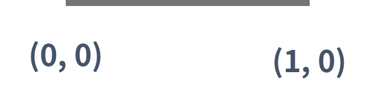
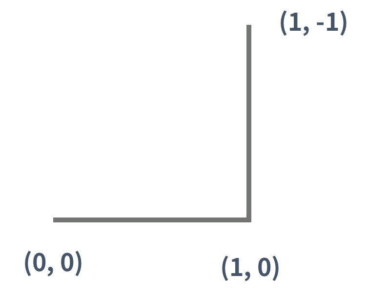
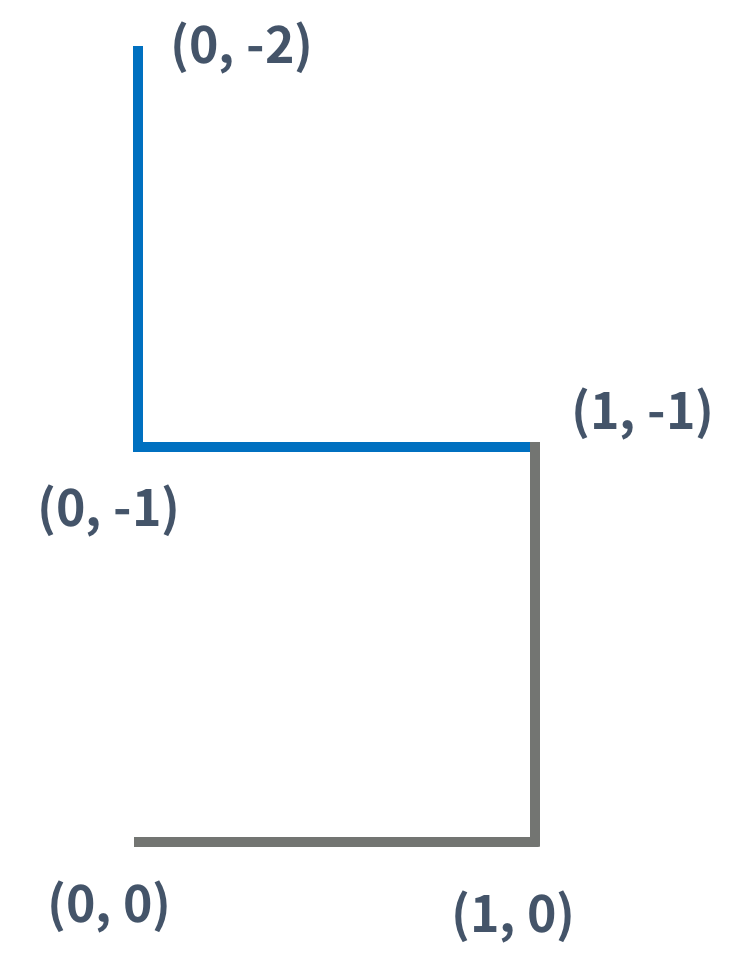
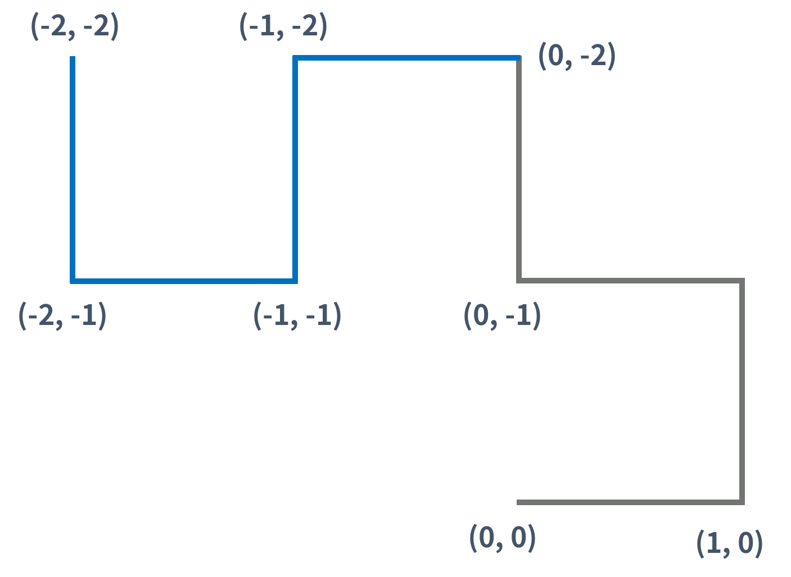

## 15685번 드래곤 커브


## 문제

드래곤 커브는 다음과 같은 세 가지 속성으로 이루어져 있으며, 이차원 좌표 평면 위에서 정의된다. 좌표 평면의 x축은 → 방향, y축은 ↓ 방향이다.

1. 시작 점
2. 시작 방향
3. 세대

0세대 드래곤 커브는 아래 그림과 같은 길이가 1인 선분이다. 아래 그림은 (0, 0)에서 시작하고, 시작 방향은 오른쪽인 0세대 드래곤 커브이다.



1세대 드래곤 커브는 0세대 드래곤 커브를 끝 점을 기준으로 시계 방향으로 90도 회전시킨 다음 0세대 드래곤 커브의 끝 점에 붙인 것이다. 끝 점이란 시작 점에서 선분을 타고 이동했을 때, 가장 먼 거리에 있는 점을 의미한다.



2세대 드래곤 커브도 1세대를 만든 방법을 이용해서 만들 수 있다. (파란색 선분은 새로 추가된 선분을 나타낸다)



3세대 드래곤 커브도 2세대 드래곤 커브를 이용해 만들 수 있다. 아래 그림은 3세대 드래곤 커브이다.



즉, K(K > 1)세대 드래곤 커브는 K-1세대 드래곤 커브를 끝 점을 기준으로 90도 시계 방향 회전 시킨 다음, 그것을 끝 점에 붙인 것이다.

크기가 100×100인 격자 위에 드래곤 커브가 N개 있다. 이때, 크기가 1×1인 정사각형의 네 꼭짓점이 모두 드래곤 커브의 일부인 정사각형의 개수를 구하는 프로그램을 작성하시오. 격자의 좌표는 (x, y)로 나타내며, 0 ≤ x ≤ 100, 0 ≤ y ≤ 100만 유효한 좌표이다.


## 입력

첫째 줄에 드래곤 커브의 개수 N(1 ≤ N ≤ 20)이 주어진다. 둘째 줄부터 N개의 줄에는 드래곤 커브의 정보가 주어진다. 드래곤 커브의 정보는 네 정수 x, y, d, g로 이루어져 있다. x와 y는 드래곤 커브의 시작 점, d는 시작 방향, g는 세대이다. (0 ≤ x, y ≤ 100, 0 ≤ d ≤ 3, 0 ≤ g ≤ 10)

입력으로 주어지는 드래곤 커브는 격자 밖으로 벗어나지 않는다. 드래곤 커브는 서로 겹칠 수 있다.

방향은 0, 1, 2, 3 중 하나이고, 다음을 의미한다.

- 0: x좌표가 증가하는 방향 (→)
- 1: y좌표가 감소하는 방향 (↑)
- 2: x좌표가 감소하는 방향 (←)
- 3: y좌표가 증가하는 방향 (↓)


## 출력

첫째 줄에 크기가 1×1인 정사각형의 네 꼭짓점이 모두 드래곤 커브의 일부인 것의 개수를 출력한다.


## Point


- 이전 드래곤을 만들면서 지나왔던 방향을 배열에 담아 새로운 드래곤커브를 만들 때 이를 스택으로 pop하여 방향을 반시계 방향으로 돌리고 새로운 배열에 추가한다.
- 방향의 순서는 델타 배열에서 잘 선정한다.
- 세대를 올리면서 재귀적으로 새로운 드래곤 커브를 만들었다. 드래곤 커브가 지나온 x,y 좌표는 방문처리를 한다.
- x,y : 100,100 범위를 순회하면서 4방향이 모두 방문처리가 되어있다면 res에 1을 더한다.


### Code


```python
import sys

n = int(sys.stdin.readline())
dx = [0,-1,0,1]
dy = [1,0,-1,0]
square = [[0]*101 for _ in range(101)]
res = 0

def makeDragon(x,y,dirs,g,cnt):
    if g > cnt:
        new_dirs = []
        for i in range(len(dirs),0,-1):
            if dirs[i-1] == 3:
                new_dirs.append(0)
            else:
                new_dirs.append(dirs[i-1] + 1)
            x += dx[new_dirs[-1]]
            y += dy[new_dirs[-1]]
            square[x][y] = 1
        new_dirs = dirs + new_dirs
        makeDragon(x,y,new_dirs,g,cnt + 1)

def isDragon(x,y):
    for i in range(x,x+2):
        for j in range(y,y+2):
            if square[i][j] == 0:
                return False
    return True

for _ in range(n):
    y,x,d,g = map(int,sys.stdin.readline().split())
    square[x][y] = 1
    x += dx[d]
    y += dy[d]
    square[x][y] = 1
    makeDragon(x,y,[d],g,0)

for i in range(100):
    for j in range(100):
        if isDragon(i,j):
            res += 1

print(res)
```

