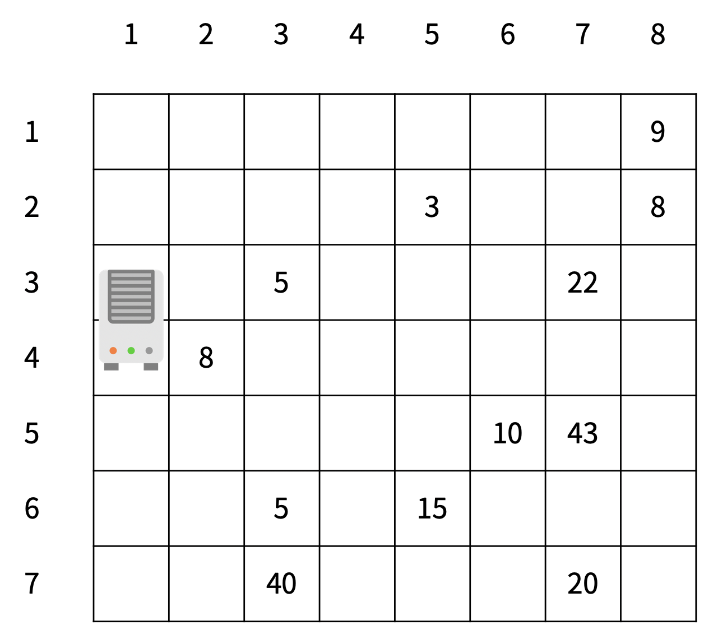

## 17144번 미세먼지 안녕!


미세먼지를 제거하기 위해 구사과는 공기청정기를 설치하려고 한다. 공기청정기의 성능을 테스트하기 위해 구사과는 집을 크기가 R×C인 격자판으로 나타냈고, 1×1 크기의 칸으로 나눴다. 구사과는 뛰어난 코딩 실력을 이용해 각 칸 (r, c)에 있는 미세먼지의 양을 실시간으로 모니터링하는 시스템을 개발했다. (r, c)는 r행 c열을 의미한다.



공기청정기는 항상 1번 열에 설치되어 있고, 크기는 두 행을 차지한다. 공기청정기가 설치되어 있지 않은 칸에는 미세먼지가 있고, (r, c)에 있는 미세먼지의 양은 Ar,c이다.

1초 동안 아래 적힌 일이 순서대로 일어난다.

1. 미세먼지가 확산된다. 확산은 미세먼지가 있는 모든 칸에서 동시에 일어난다.
   - (r, c)에 있는 미세먼지는 인접한 네 방향으로 확산된다.
   - 인접한 방향에 공기청정기가 있거나, 칸이 없으면 그 방향으로는 확산이 일어나지 않는다.
   - 확산되는 양은 Ar,c/5이고 소수점은 버린다.
   - (r, c)에 남은 미세먼지의 양은 Ar,c - (Ar,c/5)×(확산된 방향의 개수) 이다.
2. 공기청정기가 작동한다.
   - 공기청정기에서는 바람이 나온다.
   - 위쪽 공기청정기의 바람은 반시계방향으로 순환하고, 아래쪽 공기청정기의 바람은 시계방향으로 순환한다.
   - 바람이 불면 미세먼지가 바람의 방향대로 모두 한 칸씩 이동한다.
   - 공기청정기에서 부는 바람은 미세먼지가 없는 바람이고, 공기청정기로 들어간 미세먼지는 모두 정화된다.

다음은 확산의 예시이다.


왼쪽과 오른쪽에 칸이 없기 때문에, 두 방향으로만 확산이 일어났다.


인접한 네 방향으로 모두 확산이 일어난다.


공기청정기가 있는 칸으로는 확산이 일어나지 않는다.

공기청정기의 바람은 다음과 같은 방향으로 순환한다.


방의 정보가 주어졌을 때, T초가 지난 후 구사과의 방에 남아있는 미세먼지의 양을 구해보자.


## 입력

첫째 줄에 R, C, T (6 ≤ R, C ≤ 50, 1 ≤ T ≤ 1,000) 가 주어진다.

둘째 줄부터 R개의 줄에 Ar,c (-1 ≤ Ar,c ≤ 1,000)가 주어진다. 공기청정기가 설치된 곳은 Ar,c가 -1이고, 나머지 값은 미세먼지의 양이다. -1은 2번 위아래로 붙어져 있고, 가장 윗 행, 아랫 행과 두 칸이상 떨어져 있다.


## 출력

첫째 줄에 T초가 지난 후 구사과 방에 남아있는 미세먼지의 양을 출력한다.


## Point


- 확산 함수와 청정기의 바람 함수를 따로 구현하여 매 초마다 순서대로 진행
- 시계방향과 반시계방향의 각각 위치에 대한 배열을 만들어 clean 함수가 진행 될 때 하나 전 인덱스로 값을 옮기고 마지막 인덱스에 해당하는 값은 0으로 만든다.
- 미세먼지 위치와 확산되기 전 값을 저장한 배열을 만들어 매 초 마다 이 배열을 초기화하고 배열을 순회하면서 확산 함수를 진행한다.


### Code


```python
import sys

r,c,t = map(int,sys.stdin.readline().split())
dustArr = []
dustList = []
inverseCycle = []
normalCycle = []

dx = [1,-1,0,0]
dy = [0,0,1,-1]

for i in range(r):
    dustArr.append(list(map(int,sys.stdin.readline().split())))

def checkDust():
    for i in range(r):
        for j in range(c):
            if dustArr[i][j] > 0:
                dustList.append([i,j,dustArr[i][j]//5])

def spread():
    global dustList
    for dust in dustList:
        cnt = 0
        for i in range(4):
            x = dust[0] + dx[i]
            y = dust[1] + dy[i]
            if 0 <= x < r and 0 <= y < c and dustArr[x][y] > -1:
                dustArr[x][y] += dust[2]
                cnt += 1
        dustArr[dust[0]][dust[1]] -= dust[2]*cnt
    dustList = []

def clean(lst):
    for i in range(1,len(lst)):
        pre_x,pre_y = lst[i-1][0],lst[i-1][1]
        x,y = lst[i][0],lst[i][1]
        dustArr[pre_x][pre_y] = dustArr[x][y]
        if i == len(lst)-1:
            dustArr[x][y] = 0

isInverse = True

for i in range(r):
    for j in range(c):
        if dustArr[i][j] == -1:
            if isInverse:
                isInverse = False
                for k in range(i-1,0,-1):
                    inverseCycle.append([k,j])
                for k in range(c-1):
                    inverseCycle.append([0,k])
                for k in range(i):
                    inverseCycle.append([k,c-1])
                for k in range(c-1,0,-1):
                    inverseCycle.append([i,k])
            else:
                for k in range(i+1,r-1):
                    normalCycle.append([k,j])
                for k in range(c-1):
                    normalCycle.append([r-1,k])
                for k in range(r-1,i,-1):
                    normalCycle.append([k,c-1])
                for k in range(c-1,0,-1):
                    normalCycle.append([i,k])

for i in range(t):
    checkDust()
    spread()
    clean(inverseCycle)
    clean(normalCycle)

cnt = 0

for i in range(r):
    for j in range(c):
        if dustArr[i][j] > 0:
            cnt += dustArr[i][j]

print(cnt)
```

