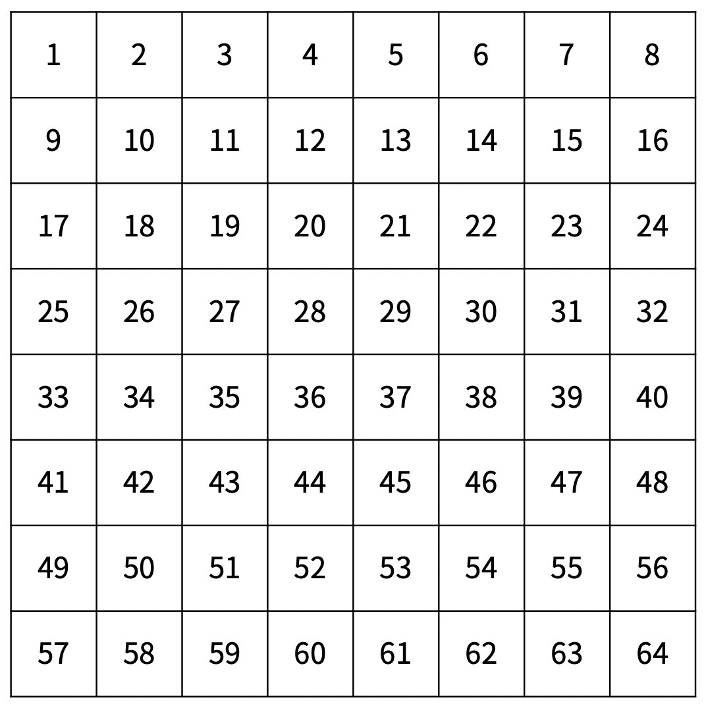
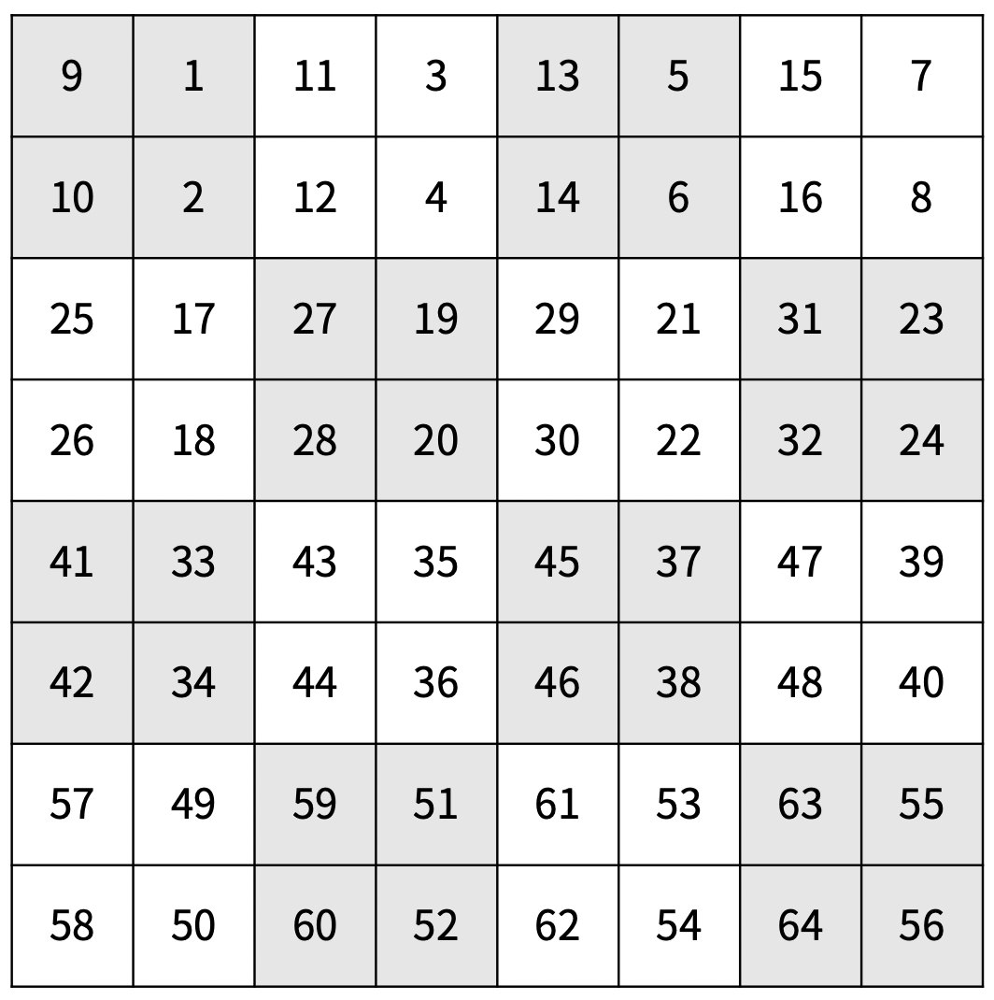
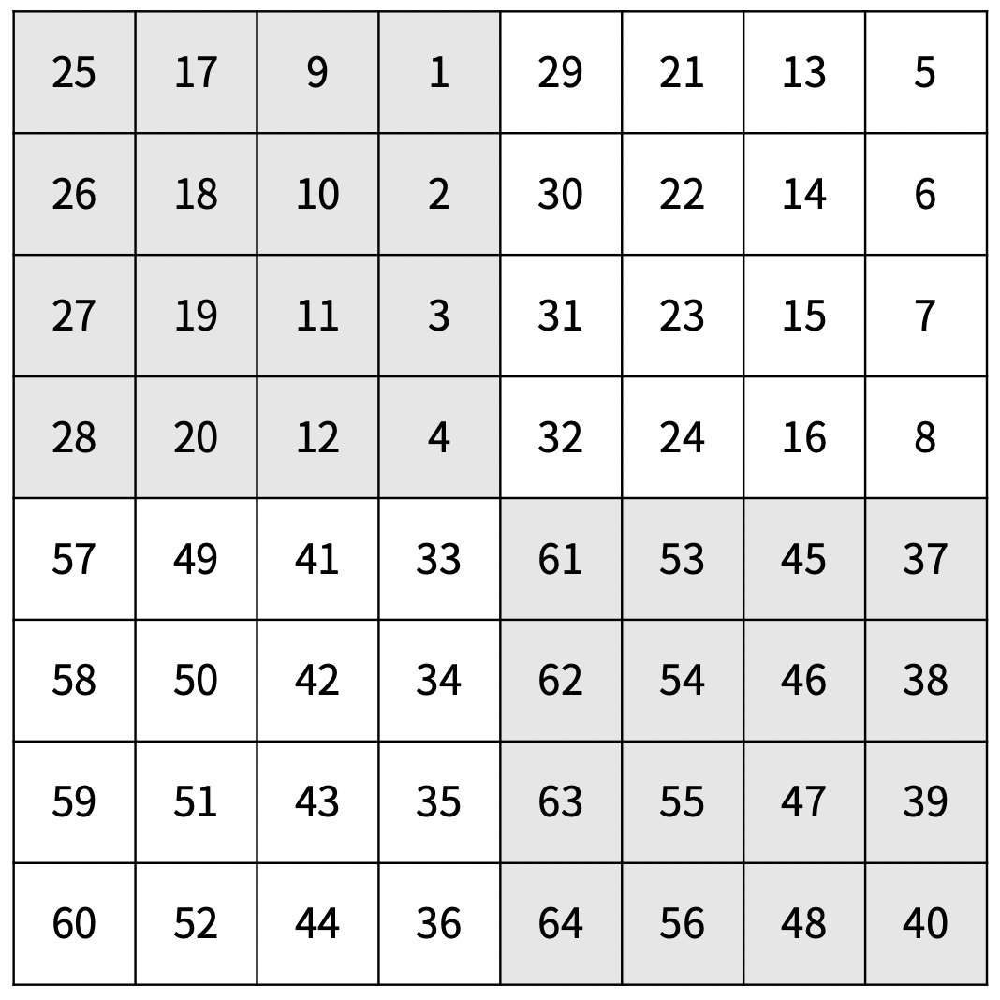

# 20058번 마법사 상어와 파이어스톰


### 문제


마법사 상어는 [파이어볼](https://www.acmicpc.net/problem/20056)과 [토네이도](https://www.acmicpc.net/problem/20057)를 조합해 파이어스톰을 시전할 수 있다. 오늘은 파이어스톰을 크기가 2N × 2N인 격자로 나누어진 얼음판에서 연습하려고 한다. 위치 (r, c)는 격자의 r행 c열을 의미하고, A[r][c]는 (r, c)에 있는 얼음의 양을 의미한다. A[r][c]가 0인 경우 얼음이 없는 것이다.

파이어스톰을 시전하려면 시전할 때마다 단계 L을 결정해야 한다. 파이어스톰은 먼저 격자를 2L × 2L 크기의 부분 격자로 나눈다. 그 후, 모든 부분 격자를 시계 방향으로 90도 회전시킨다. 이후 얼음이 있는 칸 3개 또는 그 이상과 인접해있지 않은 칸은 얼음의 양이 1 줄어든다. (r, c)와 인접한 칸은 (r-1, c), (r+1, c), (r, c-1), (r, c+1)이다. 아래 그림의 칸에 적힌 정수는 칸을 구분하기 위해 적은 정수이다.

|  |  |  |
| --------------------------------- | ------------------------------------------------ | ------------------------------------------------ |
| 마법을 시전하기 전                | L = 1                                            | L = 2                                            |

마법사 상어는 파이어스톰을 총 Q번 시전하려고 한다. 모든 파이어스톰을 시전한 후, 다음 2가지를 구해보자.

1. 남아있는 얼음 A[r][c]의 합
2. 남아있는 얼음 중 가장 큰 덩어리가 차지하는 칸의 개수

얼음이 있는 칸이 얼음이 있는 칸과 인접해 있으면, 두 칸을 연결되어 있다고 한다. 덩어리는 연결된 칸의 집합이다.


---

### 입력


첫째 줄에 N과 Q가 주어진다. 둘째 줄부터 2N개의 줄에는 격자의 각 칸에 있는 얼음의 양이 주어진다. r번째 줄에서 c번째 주어지는 정수는 A[r][c] 이다.

마지막 줄에는 마법사 상어가 시전한 단계 L1, L2, ..., LQ가 순서대로 주어진다.


---

### 출력


첫째 줄에 남아있는 얼음 A[r][c]의 합을 출력하고, 둘째 줄에 가장 큰 덩어리가 차지하는 칸의 개수를 출력한다. 단, 덩어리가 없으면 0을 출력한다.


---

## Point


1. 게임 진행 과정을 영역 분리, 회전, 얼음 녹음 으로 구분할 수 있다. 이 세 가지 과정을 함수로 분리하여 구현하였다.
1. 회전하는 과정은 행마다 반복문을 돌면서 같은 크기의 새 배열에 오른쪽부터 한 열로 저장하였다.
1. 얼음이 녹는 과정은 녹는 얼음을 바로 적용시키는 게 아닌 배열에 저장하였다가 전체 녹는 얼음 판별이 다 끝나고 배열의 값을 감소시켰다.


## CODE


```python
import sys
from collections import deque

n,q = map(int,sys.stdin.readline().split())
n = 2**n
arr = []

for _ in range(n):
    arr.append(list(map(int,sys.stdin.readline().split())))

mage = list(map(int,sys.stdin.readline().split()))

dx = [0,1,0,-1]
dy = [1,0,-1,0]

def rotate(x,y,level):
    new_arr = [[0]*level for _ in range(level)]
    for i in range(level):
        for j in range(level):
            new_arr[j][level-i-1] = arr[x+i][y+j]
    for i in range(x,x+level):
        for j in range(y,y+level):
            arr[i][j] = new_arr[i-x][j-y]

def seperate(level):
    level = 2**level
    for i in range(n//level):
        i = level*i
        for j in range(n//level):
            j = level*j
            rotate(i,j,level)

def isMelt(x,y):
    cnt = 0
    for t in range(4):
        nx = x + dx[t]
        ny = y + dy[t]
        if 0 <= nx < n and 0 <= ny < n and arr[nx][ny] > 0:
            cnt += 1
    if cnt > 2:
        return True
    return False

def melt():
    melted_area = []
    for i in range(n):
        for j in range(n):
            if not isMelt(i,j):
                melted_area.append([i,j])
    for t in melted_area:
        arr[t[0]][t[1]] = max(arr[t[0]][t[1]] - 1,0)

def bfs(x,y):
    queue = deque([[x,y]])
    visit[x][y] = 1
    size = 1
    while queue:
        x,y = queue.popleft()
        for t in range(4):
            nx = x + dx[t]
            ny = y + dy[t]
            if 0 <= nx < n and 0 <= ny < n and visit[nx][ny] == 0 and arr[nx][ny] > 0:
                visit[nx][ny] = 1
                size += 1
                queue.append([nx,ny])
    return size


res = 0
sum_ = 0
visit = [[0]*n for _ in range(n)]

for level in mage:
    seperate(level)
    melt()

for i in range(n):
    for j in range(n):
        sum_ += arr[i][j]
        if arr[i][j] > 0 and visit[i][j] == 0:
            res = max(res,bfs(i,j))

print(sum_)
print(res)
```

