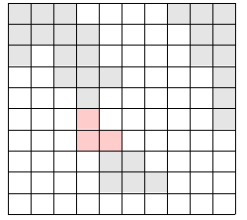

# 2146번 다리 만들기


### 문제


여러 섬으로 이루어진 나라가 있다. 이 나라의 대통령은 섬을 잇는 다리를 만들겠다는 공약으로 인기몰이를 해 당선될 수 있었다. 하지만 막상 대통령에 취임하자, 다리를 놓는다는 것이 아깝다는 생각을 하게 되었다. 그래서 그는, 생색내는 식으로 한 섬과 다른 섬을 잇는 다리 하나만을 만들기로 하였고, 그 또한 다리를 가장 짧게 하여 돈을 아끼려 하였다.

이 나라는 N×N크기의 이차원 평면상에 존재한다. 이 나라는 여러 섬으로 이루어져 있으며, 섬이란 동서남북으로 육지가 붙어있는 덩어리를 말한다. 다음은 세 개의 섬으로 이루어진 나라의 지도이다.


위의 그림에서 색이 있는 부분이 육지이고, 색이 없는 부분이 바다이다. 이 바다에 가장 짧은 다리를 놓아 두 대륙을 연결하고자 한다. 가장 짧은 다리란, 다리가 격자에서 차지하는 칸의 수가 가장 작은 다리를 말한다. 다음 그림에서 두 대륙을 연결하는 다리를 볼 수 있다.



물론 위의 방법 외에도 다리를 놓는 방법이 여러 가지 있으나, 위의 경우가 놓는 다리의 길이가 3으로 가장 짧다(물론 길이가 3인 다른 다리를 놓을 수 있는 방법도 몇 가지 있다).

지도가 주어질 때, 가장 짧은 다리 하나를 놓아 두 대륙을 연결하는 방법을 찾으시오.


---

### 입력


첫 줄에는 지도의 크기 N(100이하의 자연수)가 주어진다. 그 다음 N줄에는 N개의 숫자가 빈칸을 사이에 두고 주어지며, 0은 바다, 1은 육지를 나타낸다. 항상 두 개 이상의 섬이 있는 데이터만 입력으로 주어진다.

---

### 출력


첫째 줄에 가장 짧은 다리의 길이를 출력한다.

---

## Point


1. bfs를 통해 각 나라마다 포함하는 좌표를 모두 구한다. 나라의 경계면이 다리를 지을 수 있는 후보지이기 때문에 동서남북으로 인접한arr 좌표 값이 0인 곳을 포함하는 좌표를 모두 candidate 리스트에 추가한다.
2. 이렇게 나라 개수만큼 candidate 리스트를 만든 후 각각 candidate 리스트 끼리 비교를 한다.
3. 이 때 각 좌표 끼리 맨하튼 거리를 측정하여 최소 값을 반환한다. 


## CODE

```python
import sys
from collections import deque

n = int(sys.stdin.readline())
arr = []

dx = [1,-1,0,0]
dy = [0,0,1,-1]

for _ in range(n):
    arr.append(sys.stdin.readline().split())

visit = [[0]*n for _ in range(n)]

def bfs(queue):
    candidate = []
    while queue:
        x,y = queue.popleft()
        if isBorder(x,y):
            candidate.append([x,y])
        for t in range(4):
            nx = x + dx[t]
            ny = y + dy[t]
            if 0 <= nx < n and 0 <= ny < n and arr[nx][ny] == "1" and visit[nx][ny] == 0:
                visit[nx][ny] = 1
                queue.append([nx,ny])
    return candidate

def isBorder(x,y):
    for t in range(4):
        nx = x + dx[t]
        ny = y + dy[t]
        if 0 <= nx < n and 0 <= ny < n and arr[nx][ny] == "0":
            return True
    return False

def distance(x,y):
    return abs(x[0] - y[0]) + abs(x[1] - y[1])

def compare(x,y):
    bridge = int(1e9)
    for i in x:
        for j in y:
            bridge = min(bridge,distance(i,j)-1)
    return bridge

res = int(1e9)

border = []

for i in range(n):
    for j in range(n):
        if arr[i][j] == "1" and visit[i][j] == 0:
            queue = deque([[i,j]])
            visit[i][j] = 1
            border.append(bfs(queue))

for i in range(len(border)):
    for j in range(i+1,len(border)):
        res = min(res,compare(border[i],border[j]))

print(res)
```

