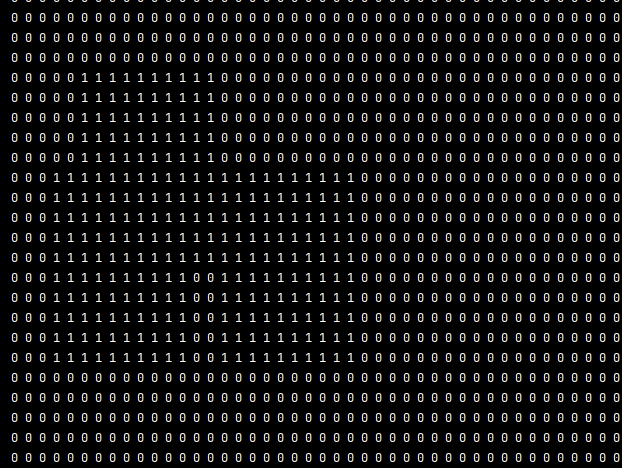

# 😇2563

## 👺필요한 개념

- 그리드 활용

- 카운트 함수 활용

## 👺풀이과정

- 그리드에 해당되는 좌표에 1씩 대입 한 후 
- 1을 카운트하여 면적을 계산함
- 

## 👺코드

```python
import sys
sys.stdin = open('input.txt')

#테스트 케이스 입력
tc = int(input())

#그리드 생성 가로,세로 100
grid = [[0 for _ in range(101)] for _ in range(101)]

#테스트 케이스만큼 반복
for _ in range(tc):

    # N, K 입력
    N, K = map(int, input().split())

    #색종이 길이 입력력
    M = 10

    #그리드에 1씩 대입
    for y in range(K,K+10):
        for x in range(N,N+10):
            grid[y][x]=1

# 검은 영역 출력
a=0
for row in grid:
    a+=row.count(1)
print(a)


```

